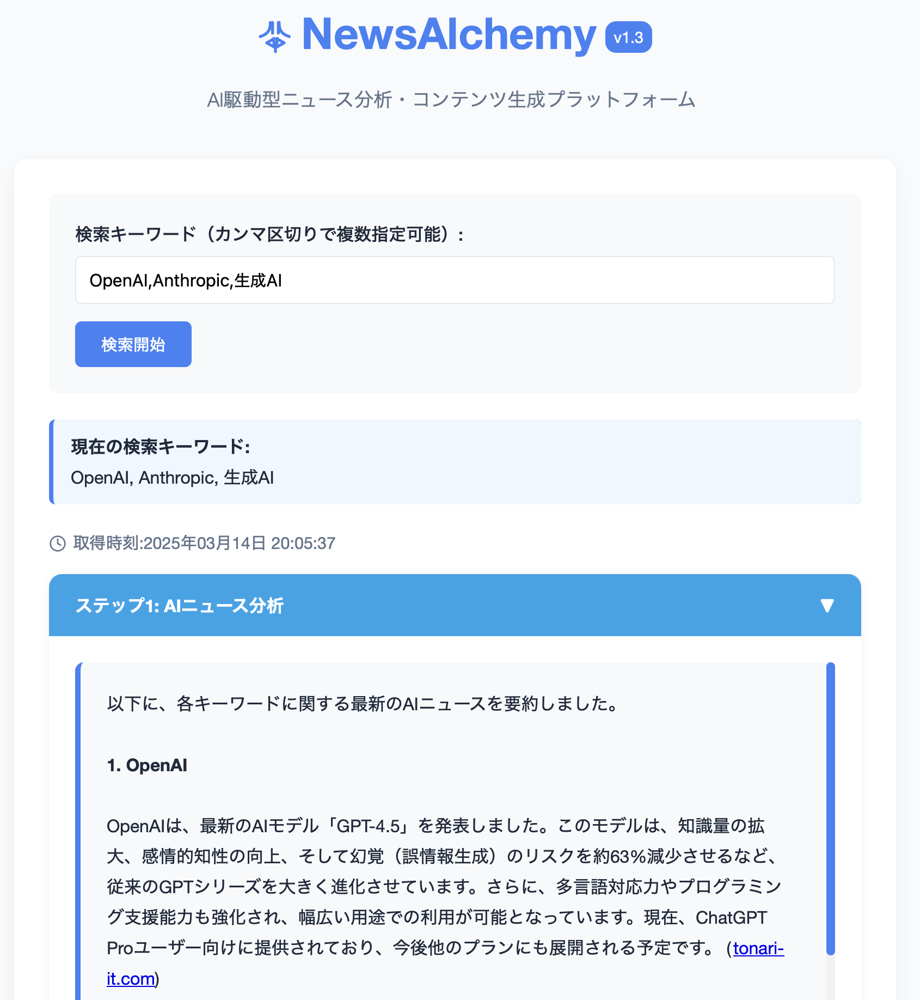

# NewsAlchemy

<div align="center">
  <h3>AI駆動型ニュース分析・コンテンツ生成プラットフォーム</h3>
</div>

## 🚀 概要

NewsAlchemyはOpenAI APIを活用し、特定のキーワードに関連する最新ニュースを自動分析し、様々なフォーマットのコンテンツを生成するウェブアプリケーションです。AIを活用したニュース要約と、多様なコンテンツ形式（ブログ記事、ニュースレター、エグゼクティブサマリー、SNS投稿、技術レポート）の自動生成を実現します。

## ✨ 主な機能

- 🔍 キーワードベースのニュース検索と分析
- 📊 AI駆動のニュース要約と重要ポイント抽出
- 📝 複数フォーマットでのコンテンツ自動生成
  - ブログ記事
  - ニュースレター
  - エグゼクティブサマリー
  - SNS投稿
  - 技術レポート
- 📋 生成コンテンツのコピーとダウンロード
- 🔄 直感的なユーザーインターフェース

## 🖼️ スクリーンショット



## 🌐デモ版
 https://tanu-ai.blog/tool/news/index.php

## 🛠️ 技術スタック

- PHP 7.4+
- JavaScript (ES6)
- OpenAI API (gpt-4oまたはmini)
- HTML5 / CSS3

## 📋 必要条件

- PHP 7.4以上
- OpenAI APIキー
- ウェブサーバー (Apache/Nginx)

## 🚀 インストール方法

1. リポジトリをクローン
```bash
git clone https://github.com/tanuu5/newsalchemy.git
```

2. ディレクトリに移動
```bash
cd newsalchemy
```

3. `config.php`ファイルを編集し、OpenAI APIキーを設定
```php
define('OPENAI_API_KEY', 'your_openai_api_key_here');
```

4. ウェブサーバーのルートディレクトリにファイルを配置するか、ローカル開発サーバーを起動

5. ブラウザでアクセスして使用開始

## 🔒 セキュリティに関する注意

- `config.php`ファイルはAPIキーを含むため、ウェブルートディレクトリ外に配置することを強く推奨します
- `.htaccess`ファイルを使用して、設定ファイルへの直接アクセスを制限してください

## 🤖 AIモデルについて（コーディング・設計サポート）

- ベースロジック: ChatGPT-o3-mini-high
- コーディング: Claude 3.7 Sonnet
- APIリクエスト: gpt-4o または miniなど(OpenAI API)

## 📝 使用方法

1. 検索キーワードを入力（カンマ区切りで複数指定可能）
2. 「検索開始」ボタンをクリックしてAIによるニュース分析を実行
3. ニュース分析結果を確認し、「コンテンツ作成へ進む」をクリック
4. 出力フォーマットを選択し、「コンテンツを生成」をクリック
5. 生成されたコンテンツをコピーまたはダウンロード

## 🔜 今後の開発予定

- RSS/Atomフィードの統合
- ビジュアルデータ分析とグラフ表示
- マルチメディアコンテンツの生成
- コラボレーション機能
- AI生成画像との統合
- 会話型インターフェース

## 👨‍💻 開発者

- たぬ

## 📄 ライセンス

このプロジェクトは[MITライセンス](LICENSE)の下で公開されています。
